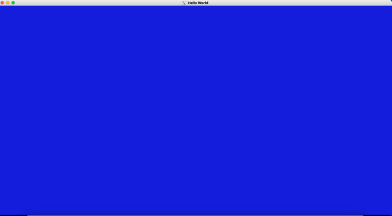
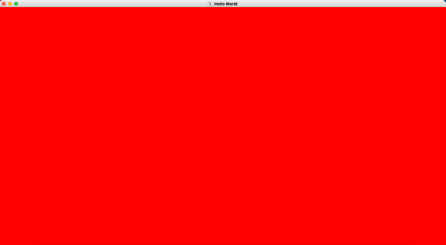
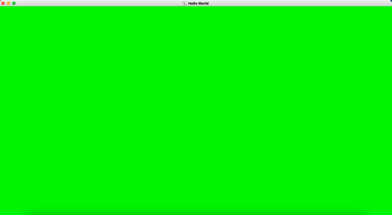

Project1

  

What I implemented

1. The program initializes GLUT, creates a window of a specified size by using the 'width' and 'height' variables and initializes an OpenGL context inside the window.
2. Initialize the **OpenGL viewport** to the same size as the window size. The **background** is cleared and set to Blue.
3. Callbacks for 'glutDisplayFunc', 'glutKeyboardFunc' and 'glutIdleFunc' are registered.
  1. renderSceneCB

Clears and updates the background color using the global RGBA values and swaps the front and back buffers

  1. processNormalKeyCB

Calls glutLeaveMainLoop in the event of a 'ESC' key press

  1. updateColor

Updates the background color 1 channel by incrementing and simultaneously decrementing another color channel at a time. Calls glutPostRedisplay() to render the clear and update the background.

1. Once the callbacks are registered, the program enters glutMainLoop to start.

Additional functionalities beyond project requirements

1. The background animation has a smooth incremental transition from one color to the next instead of a quick strobing effect.
2. The animations are updated based on the time increments since the last glutGet(GLUT\_ELAPSED\_TIME) call.

How to use my implementation

1. Compile the code

/usr/bin/clang++ -fdiagnostics-color=always -g helloworld.cpp -o helloworld -I/Users/abalaji/Downloads/homebrew/include/ -L/Users/abalaji/Downloads/homebrew/lib/ -lglut -lgl -framework IOKit -framework Cocoa -framework OpenGL

2. Run the executable

./helloworld

Configuration

Operating System: macOS 11.3 Big Sur

FreeGLUT version: 3.2.1

Compiler:

Apple clang version 12.0.5 (clang-1205.0.22.11)

Target: x86\_64-apple-darwin20.4.0

External libraries and additional requirements to compile the project

FreeGLUT is required to compile the project
